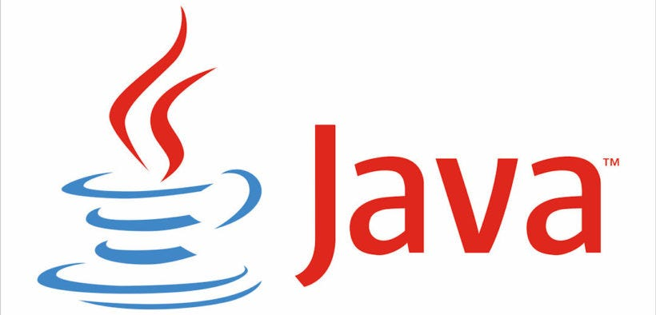

  

  
  
  

# Java Stuff

Java Programming Language basics, fundamentals and references.

## Summary

### Input / Output

1. [Scanner Input](./src/com/solitudeworks/input/ScannerInput.java)
2. [BufferedReader Input](./src/com/solitudeworks/input/BufferedReaderInput.java)
3. [JOption Input](./src/com/solitudeworks/input/JOptionInput.java)

### Stuff

1. [Bogo Sort](./src/com/solitudeworks/stuff/bogosort/BogoSort.java)
2. [Weasel](./src/com/solitudeworks/stuff/weasel/Weasel.java)
3. [OOP Sample (Power Supply)](./src/com/solitudeworks/stuff/powersupply)

## Contribute

Fork the repository and create a pull request.

## License

This project is licensed under the [General Public License v3.0](https://www.gnu.org/licenses/gpl-3.0.pt-br.html) - see the [LICENSE](LICENSE) file for details.
